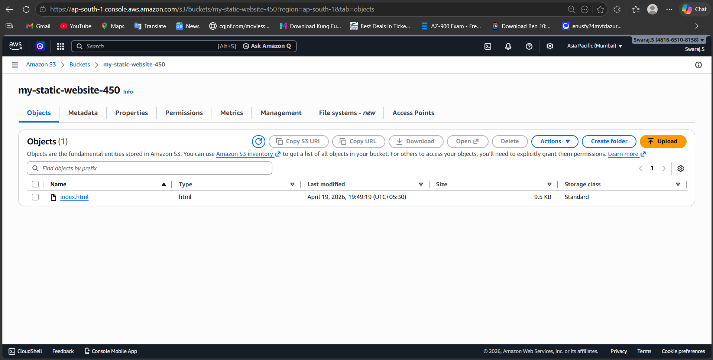
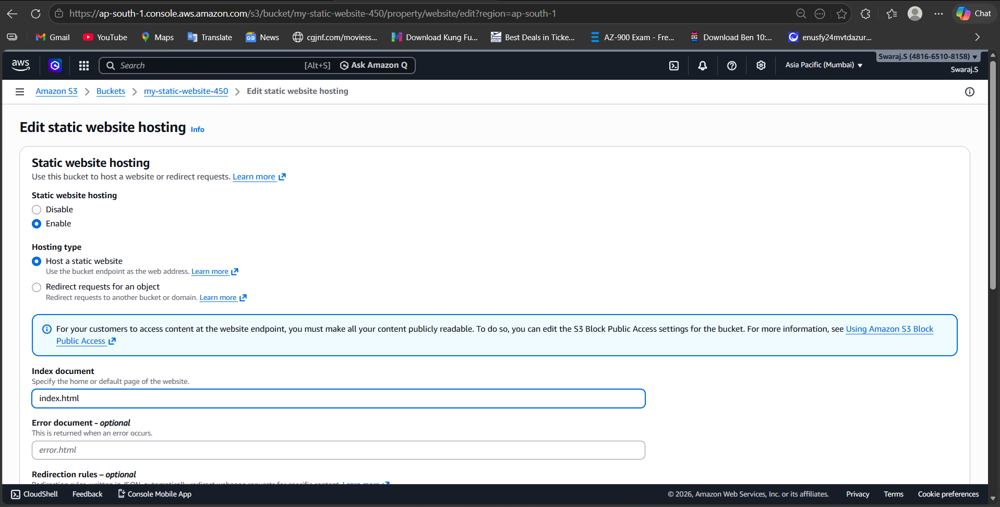
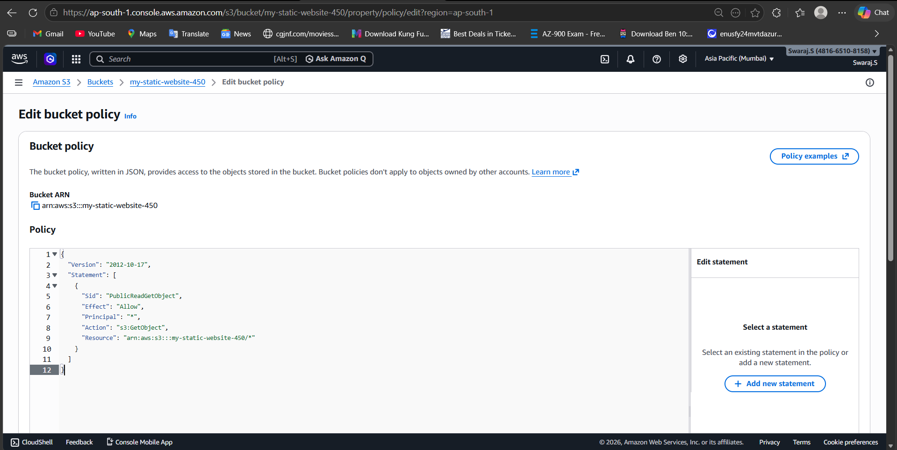
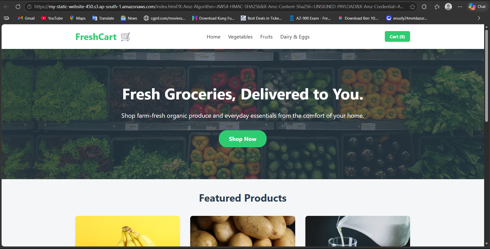

# 🚀 AWS S3 Static Website Hosting

---

## 📌 Project Overview

This project demonstrates how to host a static website using Amazon S3.

The implementation covers:
- Creating an S3 bucket
- Uploading website files (HTML/CSS)
- Enabling static website hosting
- Configuring bucket policy for public access
- Accessing the website via S3 endpoint

---

## 🏗️ Architecture

User → S3 Bucket → Static Website Hosting → Public URL

---

## ⚙️ Implementation Steps

### 🔹 Step 1: Create S3 Bucket
- Created a bucket in AWS S3
- Region: ap-south-1

---

### 🔹 Step 2: Upload Website Files
- Uploaded index.html file into the bucket

---

### 🔹 Step 3: Enable Static Website Hosting
- Enabled static hosting in Properties
- Set index document: index.html

---

### 🔹 Step 4: Configure Bucket Policy
- Allowed public access using bucket policy

{
  "Version": "2012-10-17",
  "Statement": [
    {
      "Sid": "PublicReadGetObject",
      "Effect": "Allow",
      "Principal": "*",
      "Action": "s3:GetObject",
      "Resource": "arn:aws:s3:::my-static-website-450/*"
    }
  ]
}

---

### 🔹 Step 5: Access Website
- Opened the S3 static website endpoint
- Website successfully hosted

---

## 🌐 Final Output

Static website successfully deployed on AWS S3  
Accessible via public endpoint  
Fully functional frontend website  

---

## 📚 Learning Outcomes

- Understanding AWS S3 service  
- Static website hosting configuration  
- Bucket policy & public access control  
- Real-world cloud deployment basics  

---

## 🚀 Future Enhancements

- Integrate CloudFront (CDN)  
- Add custom domain (Route 53)  
- Enable HTTPS using SSL  

---

## 📂 Project Structure

aws-s3-static-website-hosting/
│── images/
│   ├── s3-bucket.png
│   ├── file-upload.png
│   ├── static-hosting.png
│   ├── bucket-policy.png
│   └── website-output.png
│── index.html
│── README.md

---

## 👨‍💻 Author

Swaraj Sutradhar  
