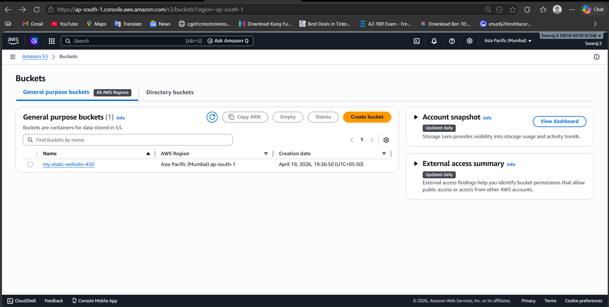

# 🚀 AWS S3 Static Website Hosting

## 📌 Project Overview
This project demonstrates how to host a static website using Amazon S3.  

---

## 🛠️ Services Used
- Amazon S3
- AWS Management Console

---

## 📂 Project Architecture
- Created S3 Bucket
- Uploaded static website files
- Enabled static hosting
- Configured public access via bucket policy

---

## ⚙️ Steps Performed

### 1️⃣ Created S3 Bucket

---

### 2️⃣ Uploaded Website Files

---

### 3️⃣ Enabled Static Website Hosting

---

### 4️⃣ Configured Bucket Policy (Public Access)

---

### 5️⃣ Final Website Output

---

## 📚 Learning Outcomes
- Learned how to host static websites on AWS S3
- Understood bucket policies and public access
- Gained hands-on experience with cloud storage services

---

## 🧠 Key Concepts
- Static Website Hosting
- Object Storage
- IAM & Bucket Policies
- Public Access Control
